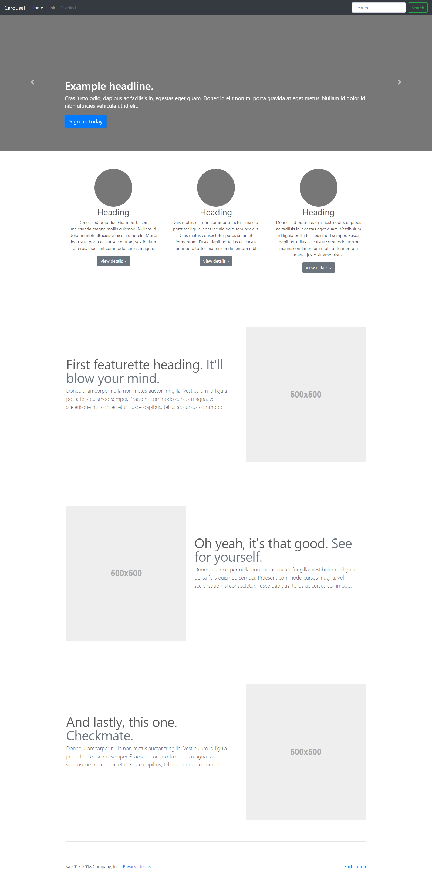

<h1>Exercícios</h1>

<h1>Exercício 1</h1>

Com base na imagem abaixo, reproduza o layout abaixo utilizando Bootstrap 4. É importante que o layout fique bem disposto em dispositivos de telas menores.

